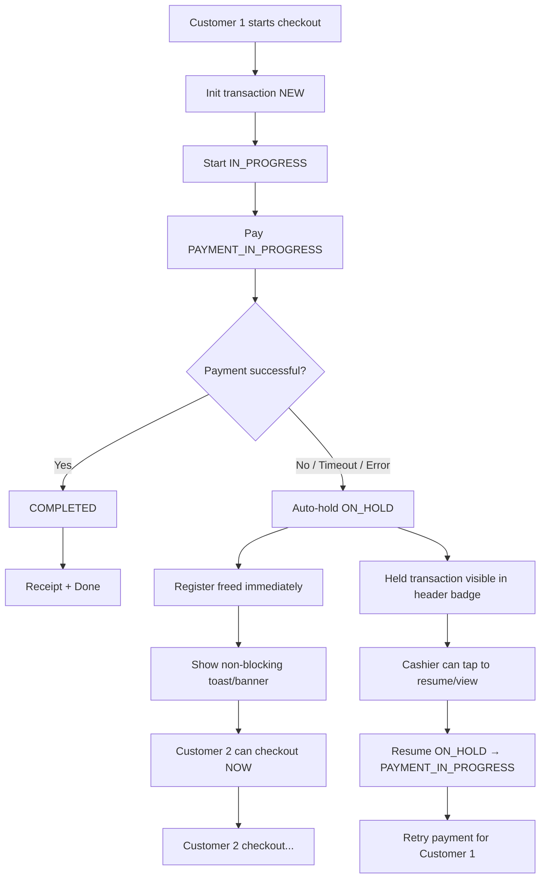
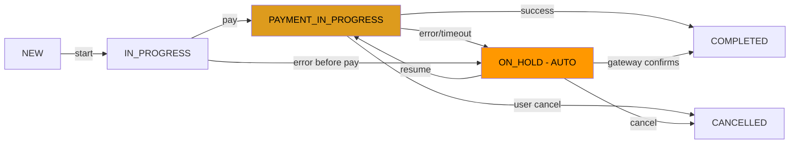

# Auto-Hold Transaction Plan — Seamless Next Customer Flow

## Problem Statement

When a customer's payment fails or encounters a problem during checkout, the current system **blocks the register** (state: `PAYMENT_IN_PROGRESS`). The next customer cannot proceed until a cashier manually clicks "Force Release Register." This causes:

- Customer frustration (waiting while cashier resolves previous issue)
- Lost sales (queue builds up, customers leave)
- Manual intervention required for every payment hiccup

## Goal

**Automatic handling**: When a payment problem occurs, the system should:
1. **Auto-hold** the stuck transaction (move to `ON_HOLD`)
2. **Immediately free the register** for the next customer
3. **Visually indicate** held transactions in the header (non-blocking)
4. **Allow resume/retry** of held transactions from the main screen

---

## Current State Machine (What Exists)

```
NEW ──────► IN_PROGRESS ──────► PAYMENT_IN_PROGRESS ──► COMPLETED
  │               │                       │
  │               │                       ├──► ON_HOLD ──► PAYMENT_IN_PROGRESS (resume)
  │               │                       │       │
  │               │                       │       └──► COMPLETED
  │               │                       │
  │               │                       └──► FAILED
  │               │
  └──► CANCELLED  └──► CANCELLED
```

**Key insight**: The state machine already supports `ON_HOLD` and auto-release. The gap is in the **frontend behavior** — the system currently shows a blocking "Register Locked" screen instead of automatically holding and proceeding.

---

## Solution Design

### Flow Diagram — New Behavior



### Key Design Decisions

1. **Auto-hold on ANY payment error**: If the `/pay` endpoint fails, or order creation fails, or any step after `PAYMENT_IN_PROGRESS` fails — the system automatically calls `/hold` and returns to the review screen without blocking.

2. **Non-blocking held transaction indicator**: Instead of a full-screen "Register Locked" modal, show a small badge/banner in the header indicating "1 transaction on hold" that the cashier can tap to manage.

3. **Queue support**: The backend already supports `getOnHoldTransactions()` — we use this to show a list of held transactions that can be resumed or cancelled.

4. **Timeout reduction**: Reduce the stale transaction timeout from 5 minutes to 2 minutes for faster auto-recovery.

---

## Files to Modify

### 1. [`backend/models/Transaction.js`](backend/models/Transaction.js)

**Changes:**
- Add a new static method `autoHoldOnError(transactionId, error)` that safely transitions any non-completed transaction to `ON_HOLD`
- Reduce `releaseStaleTransactions` default timeout from 5 min to 2 min

```javascript
// New method to add
transactionSchema.statics.autoHoldOnError = async function(transactionId, error) {
  const tx = await this.findById(transactionId);
  if (!tx) return null;
  // Only auto-hold if in a state that can transition to ON_HOLD
  if (['PAYMENT_IN_PROGRESS', 'IN_PROGRESS'].includes(tx.state)) {
    await tx.transitionTo('ON_HOLD', {
      error: error || 'Auto-held due to payment error',
      errorCode: 'AUTO_HOLD',
    });
  }
  return tx;
};
```

### 2. [`backend/routes/transactions.js`](backend/routes/transactions.js)

**Changes:**
- Add a new endpoint `POST /api/transactions/auto-hold` that the frontend can call when a payment error occurs
- This is a safety-net endpoint that always succeeds (best-effort)

```javascript
// New endpoint
router.post('/auto-hold', async (req, res) => {
  try {
    const { transactionId, reason } = req.body;
    const tx = await Transaction.autoHoldOnError(transactionId, reason);
    res.json({ 
      held: !!tx, 
      transaction: tx,
      registerAvailable: true 
    });
  } catch (err) {
    // Always return success — this is a non-critical cleanup
    res.json({ held: false, registerAvailable: true });
  }
});
```

### 3. [`frontend/components/CheckoutModal.js`](frontend/components/CheckoutModal.js)

**Changes:**
- **Auto-hold on error**: In the `handleCheckout` catch block, automatically call `/auto-hold` and return to review screen (instead of showing Alert)
- **Remove blocking hold screen**: The `paymentStep === 'onHold'` screen should no longer be a full-blocking modal. Instead, auto-hold and return to review.
- **Add `onHoldTransaction` callback prop**: When a transaction is auto-held, call a new prop `onTransactionHeld(heldTx)` so the parent App.js can show the badge.

```javascript
// In handleCheckout catch block — new auto behavior
} catch (error) {
  // Auto-hold: release register immediately, no blocking
  if (transactionId) {
    try {
      await fetch(`${API_URL}/api/transactions/auto-hold`, {
        method: 'POST',
        headers: { 'Content-Type': 'application/json' },
        body: JSON.stringify({
          transactionId,
          reason: error.message,
        }),
      });
    } catch (e) { /* non-critical */ }
  }
  
  // Notify parent about held transaction
  if (onTransactionHold && transactionId) {
    onTransactionHold({ _id: transactionId, state: 'ON_HOLD' });
  }
  
  // Return to review screen — register is now free
  setPaymentStep('review');
  setProcessing(false);
  // Show a non-blocking toast/alert instead of blocking
  Alert.alert(
    'Payment Issue',
    'The transaction has been placed on hold. The register is now available for the next customer.',
    [{ text: 'OK' }]
  );
}
```

### 4. [`frontend/App.js`](frontend/App.js)

**Changes:**
- Add state: `heldTransactions` (array)
- Add state: `showHeldTransactions` (boolean to show management modal)
- Pass `onTransactionHold` callback to `CheckoutModal`
- Show a **badge in the header** when held transactions exist
- Add a **Held Transactions modal/panel** (or reuse existing pattern)

```javascript
// New state
const [heldTransactions, setHeldTransactions] = useState([]);
const [showHeldPanel, setShowHeldPanel] = useState(false);

// New callback passed to CheckoutModal
const handleTransactionHeld = useCallback((tx) => {
  setHeldTransactions(prev => {
    const exists = prev.find(t => t._id === tx._id);
    if (exists) return prev;
    return [...prev, tx];
  });
}, []);

// Fetch held transactions on mount and periodically
useEffect(() => {
  const fetchHeld = async () => {
    try {
      const res = await axios.get(`${BASE_URL}/api/transactions/register/default/status`);
      if (res.data.onHoldTransactions?.length > 0) {
        setHeldTransactions(res.data.onHoldTransactions);
      }
    } catch (e) { /* ignore */ }
  };
  fetchHeld();
  const interval = setInterval(fetchHeld, 30000); // Poll every 30s
  return () => clearInterval(interval);
}, []);
```

**Header badge addition** (in the header section):
```jsx
{heldTransactions.length > 0 && (
  <TouchableOpacity
    onPress={() => setShowHeldPanel(true)}
    style={[styles.headerActionBtn, { backgroundColor: 'rgba(255,152,0,0.15)', borderColor: '#FF9800' }]}
    activeOpacity={0.7}
  >
    <Text style={styles.headerActionIcon}>⏸️</Text>
    <View style={styles.heldBadge}>
      <Text style={styles.heldBadgeText}>{heldTransactions.length}</Text>
    </View>
  </TouchableOpacity>
)}
```

### 5. [`frontend/components/HeldTransactionsPanel.js`](frontend/components/HeldTransactionsPanel.js) — **NEW FILE**

A modal/panel that shows all held transactions with options to:
- **Resume** (move back to `PAYMENT_IN_PROGRESS` for retry)
- **Cancel** (permanently cancel)
- **View details** (see what items were in the order)

```javascript
export default function HeldTransactionsPanel({ visible, onClose, heldTransactions, onResume, onCancel, onRefresh }) {
  // Shows list of held transactions
  // Each item shows: time held, item count, total amount
  // Actions: Resume, Cancel
}
```

### 6. [`frontend/components/UI.js`](frontend/components/UI.js)

**Changes:**
- Add styles for the held badge in the header (small circular badge with count)

---

## Implementation Steps

| Step | File | Description |
|------|------|-------------|
| 1 | [`backend/models/Transaction.js`](backend/models/Transaction.js) | Add `autoHoldOnError()` static method; reduce stale timeout to 2 min |
| 2 | [`backend/routes/transactions.js`](backend/routes/transactions.js) | Add `POST /auto-hold` endpoint |
| 3 | [`frontend/components/CheckoutModal.js`](frontend/components/CheckoutModal.js) | Auto-hold on error instead of blocking; add `onTransactionHold` prop |
| 4 | [`frontend/components/HeldTransactionsPanel.js`](frontend/components/HeldTransactionsPanel.js) | **NEW** — Panel to view/resume/cancel held transactions |
| 5 | [`frontend/App.js`](frontend/App.js) | Add held transactions state, header badge, polling, pass callbacks |
| 6 | [`frontend/components/UI.js`](frontend/components/UI.js) | Add held badge styles |

---

## State Transition Diagram — New Auto-Hold Flow



---

## UI Mock — Header with Held Badge

```
┌──────────────────────────────────────────────────────┐
│  POS Menu                    👥 ⚙️ 📦 📊 📋 ⏸️① 🔒│
│  John · cashier · 40 items                           │
├──────────────────────────────────────────────────────┤
│  [All] [Breakfast] [Lunch] [Dinner] [Drinks] [Dessert]│
├──────────────────────────────────────────────────────┤
│  ┌─────────┐  ┌─────────┐  ┌─────────┐              │
│  │  Card   │  │  Card   │  │  Card   │              │
│  │  Item   │  │  Item   │  │  Item   │              │
│  │  $12.99 │  │  $14.99 │  │  $11.99 │              │
│  │ [Add]   │  │ [Add]   │  │ [Add]   │              │
│  └─────────┘  └─────────┘  └─────────┘              │
├──────────────────────────────────────────────────────┤
│  Total: $54.96          [Cart: 4 items]  [Checkout]  │
└──────────────────────────────────────────────────────┘
```

The ⏸️① badge in the header indicates 1 transaction on hold. Tapping it opens the HeldTransactionsPanel.

---

## Edge Cases Handled

| Scenario | Behavior |
|----------|----------|
| Payment gateway timeout | Auto-hold after timeout, register freed immediately |
| Network error during order creation | Auto-hold, order not created, can retry |
| Customer walks away mid-payment | Auto-hold after 2 min stale timeout |
| Cashier wants to force-cancel | Cancel button in HeldTransactionsPanel |
| Payment actually succeeded (gateway race) | Resume checks gateway status first, auto-completes if already paid |
| Multiple held transactions | Queue shown in HeldTransactionsPanel, each independently resumable |
