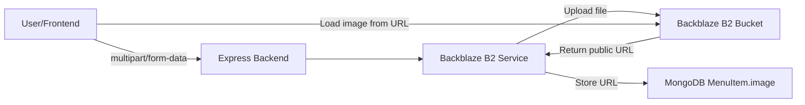

# Backblaze B2 Integration Plan — Menu Image & Document Storage

## 1. Overview

Replace the current **base64 data URL** image storage (stored directly in MongoDB) with **Backblaze B2** cloud object storage. Images will be uploaded to B2, and only the **public URL** will be stored in MongoDB. This reduces database size, improves performance, and enables CDN-backed delivery.

### Current Flow (problematic)
```
User → [base64 data URL] → MongoDB (stored as string in `MenuItem.image`)
```
- Bloats the database (a single image can be 100KB-5MB as base64)
- Slow retrieval
- No CDN caching

### Proposed Flow
```
User → [file upload] → Backend → [upload to B2] → B2 returns public URL → MongoDB stores URL
Frontend → [loads image from B2 public URL] → CDN-cached delivery
```

## 2. Architecture



## 3. Files to Create/Modify

### New Files
| File | Purpose |
|------|---------|
| [`backend/services/b2-service.js`](backend/services/b2-service.js) | Backblaze B2 client wrapper (upload, delete, list) |
| [`backend/routes/upload.js`](backend/routes/upload.js) | Upload endpoint for images/documents |

### Modified Files
| File | Change |
|------|--------|
| [`backend/.env.example`](backend/.env.example) | Add B2 config vars |
| [`backend/package.json`](backend/package.json) | Add `backblaze-b2` npm dependency |
| [`backend/routes/menu.js`](backend/routes/menu.js) | Replace base64 PUT with multipart upload route |
| [`backend/models/MenuItem.js`](backend/models/MenuItem.js) | Add `imagePublicId` field for B2 file reference |
| [`frontend/components/InventoryPanel.js`](frontend/components/InventoryPanel.js) | Change upload to send FormData instead of base64 JSON |

## 4. Backblaze B2 Setup

### Bucket Configuration
- Create a **public** bucket named `pos-menu-images` (or user-defined)
- Enable **CDN** (Backblaze B2 + Cloudflare or B2 native download URL)
- Set default file expiration policy if desired

### Environment Variables (`.env`)
```
# Backblaze B2 Configuration
B2_APPLICATION_KEY_ID=your_key_id
B2_APPLICATION_KEY=your_application_key
B2_BUCKET_NAME=pos-menu-images
B2_ENDPOINT=https://s3.us-west-004.backblazeb2.com
B2_CDN_URL=https://cdn.example.com  # Optional: custom CDN domain
```

## 5. Backend Service: [`backend/services/b2-service.js`](backend/services/b2-service.js)

### Responsibilities
- Initialize B2 client with credentials
- Upload files (buffer/stream → B2)
- Delete files (when menu item is removed or image replaced)
- Generate public URLs (with optional CDN prefix)
- Generate signed URLs for private buckets (if needed)

### API
```javascript
class B2Service {
  async uploadFile(buffer, fileName, contentType)  // → { fileId, fileName, url }
  async deleteFile(fileName, fileId)               // → boolean
  async getFileUrl(fileName)                       // → string (public URL)
  async listFiles(prefix)                          // → array of { fileName, fileId, url }
}
```

## 6. Upload Route: [`backend/routes/upload.js`](backend/routes/upload.js)

### Endpoints

| Method | Path | Description |
|--------|------|-------------|
| `POST` | `/api/upload/menu/:id/image` | Upload menu item image (multipart) |
| `POST` | `/api/upload/menu/:id/avatar` | Upload menu item avatar/thumbnail |
| `DELETE` | `/api/upload/menu/:id/image` | Delete menu item image from B2 |
| `POST` | `/api/upload/document` | Upload general document (receipt, report, etc.) |

### Request Format
```
POST /api/upload/menu/:id/image
Content-Type: multipart/form-data

file: [binary image data]
```

### Response
```json
{
  "url": "https://f002.backblazeb2.com/file/pos-menu-images/menu/abc123.jpg",
  "fileId": "4_z9f3b2a1c0d8e7f6a5b4c3d2e1f0",
  "fileName": "menu/abc123.jpg"
}
```

## 7. MongoDB Changes

### MenuItem Schema Update
Add to [`backend/models/MenuItem.js`](backend/models/MenuItem.js):
```javascript
imagePublicId: { type: String, default: '' },  // B2 file ID for deletion
imageUrl: { type: String, default: '' },       // B2 public URL (replaces `image`)
```

The existing `image` field can be repurposed or kept as-is. I recommend:
- Keep `image` field → store the B2 public URL
- Add `imagePublicId` → store the B2 file ID (needed for deletion)

### Migration
Existing base64 images in the `image` field will remain as-is. New uploads will use B2 URLs. Optionally, a migration script can move existing images to B2.

## 8. Frontend Changes

### [`frontend/components/InventoryPanel.js`](frontend/components/InventoryPanel.js)

Change `handleImageUpload` from base64 JSON to FormData:
```javascript
const handleImageUpload = async (itemId, file) => {
  const formData = new FormData();
  formData.append('file', file);
  
  const res = await fetch(`${API_URL}/api/upload/menu/${itemId}/image`, {
    method: 'POST',
    body: formData,
    // No Content-Type header — browser sets multipart boundary automatically
  });
  const data = await res.json();
  // data.url is the B2 public URL
};
```

### Image Display
No changes needed — the frontend already renders `item.image` as an `<Image source={{ uri: item.image }} />`. Since B2 URLs are standard HTTPS URLs, they work directly.

## 9. File Naming Convention

```
menu/{itemId}_{timestamp}.{ext}
  → menu/abc123_1680000000.jpg

avatars/{itemId}_{timestamp}.{ext}
  → avatars/abc123_1680000000.png

documents/{type}_{timestamp}.{ext}
  → documents/report_1680000000.pdf
```

## 10. Implementation Steps

### Step 1: Install dependency & add env vars
- `npm install backblaze-b2`
- Add B2 config to `.env` and `.env.example`

### Step 2: Create B2 service
- [`backend/services/b2-service.js`](backend/services/b2-service.js) — upload, delete, getUrl

### Step 3: Create upload routes
- [`backend/routes/upload.js`](backend/routes/upload.js) — multipart upload endpoint

### Step 4: Update MenuItem model
- Add `imagePublicId` field to schema

### Step 5: Update menu route
- Modify [`backend/routes/menu.js`](backend/routes/menu.js) to handle B2 URL storage

### Step 6: Update frontend upload
- Change [`frontend/components/InventoryPanel.js`](frontend/components/InventoryPanel.js) to use FormData

### Step 7: Test
- Upload image → verify B2 bucket has file → verify MongoDB stores URL → verify frontend loads image

## 11. Security Considerations

- **Bucket should be public** for direct image serving (no auth needed for viewing)
- **Upload endpoint should be authenticated** (add admin auth middleware)
- **File type validation** on the backend (accept only image/jpeg, image/png, image/webp)
- **File size limit** (e.g., 5MB max via `express.json({ limit: '5mb' })` or multer limits)
- **Sanitize filenames** to prevent path traversal

## 12. Dependencies

Add to [`backend/package.json`](backend/package.json):
```json
"backblaze-b2": "^latest",
"multer": "^latest"     // for multipart file upload handling
```
