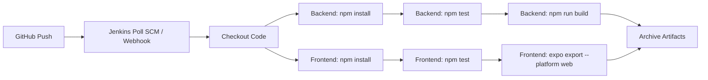

# Jenkins CI/CD Pipeline Plan — POS System

## 1. Overview

This plan outlines the setup of a Jenkins CI/CD pipeline for the POS system hosted at [`https://jenkins.transtechologies.com`](https://jenkins.transtechologies.com). The pipeline will focus on **testing and building** the application (backend + frontend web) — deployment is deferred.

**Key constraint:** No Docker is used. The Jenkins agent runs Node.js natively.

---

## 2. Architecture



### Pipeline Stages

| Stage | Description |
|-------|-------------|
| **Checkout** | Clone repo, checkout the target branch |
| **Install Backend Dependencies** | `cd backend && npm ci` |
| **Install Frontend Dependencies** | `cd frontend && npm ci` |
| **Lint / Code Quality** | Run ESLint on backend + frontend (if configured) |
| **Test Backend** | `cd backend && npm test` — runs Jest unit + integration tests |
| **Test Frontend** | `cd frontend && npm test` — runs Jest/Expo tests |
| **Build Backend** | Verify backend starts without errors (syntax check) |
| **Build Frontend (Web)** | `cd frontend && npx expo export --platform web` |
| **Archive Artifacts** | Save `frontend/dist/` and backend build output |

---

## 3. Files to Create / Modify

### 3.1 New Files

| File | Purpose |
|------|---------|
| [`Jenkinsfile`](../Jenkinsfile) | Declarative pipeline definition for Jenkins |
| [`backend/jest.config.js`](../backend/jest.config.js) | Jest configuration for backend tests |
| [`backend/tests/models/bill.test.js`](../backend/tests/models/bill.test.js) | Unit tests for Bill model |
| [`backend/tests/models/mobilePayment.test.js`](../backend/tests/models/mobilePayment.test.js) | Unit tests for MobilePayment model |
| [`backend/tests/models/order.test.js`](../backend/tests/models/order.test.js) | Unit tests for Order model |
| [`backend/tests/models/smsLog.test.js`](../backend/tests/models/smsLog.test.js) | Unit tests for SmsLog model |
| [`backend/tests/services/orange-money.test.js`](../backend/tests/services/orange-money.test.js) | Unit tests for Orange Money service |
| [`backend/tests/services/sms-service.test.js`](../backend/tests/services/sms-service.test.js) | Unit tests for SMS service |
| [`backend/tests/services/b2-service.test.js`](../backend/tests/services/b2-service.test.js) | Unit tests for B2 service |
| [`backend/tests/routes/bills.test.js`](../backend/tests/routes/bills.test.js) | Integration tests for Bills API |
| [`backend/tests/routes/menu.test.js`](../backend/tests/routes/menu.test.js) | Integration tests for Menu API |
| [`backend/tests/routes/orders.test.js`](../backend/tests/routes/orders.test.js) | Integration tests for Orders API |
| [`backend/tests/setup.js`](../backend/tests/setup.js) | Jest global setup (in-memory MongoDB, env vars) |
| [`backend/tests/teardown.js`](../backend/tests/teardown.js) | Jest global teardown |
| [`backend/.eslintrc.json`](../backend/.eslintrc.json) | ESLint config for backend |
| [`frontend/.eslintrc.json`](../frontend/.eslintrc.json) | ESLint config for frontend |

### 3.2 Modified Files

| File | Change |
|------|--------|
| [`backend/package.json`](../backend/package.json) | Add `jest`, `supertest`, `mongodb-memory-server` as devDependencies; add `test`, `test:watch`, `test:coverage` scripts |
| [`backend/.gitignore`](../backend/.gitignore) | Add `coverage/` directory |
| [`frontend/.gitignore`](../frontend/.gitignore) | Add `coverage/` directory |
| [`backend/.env.example`](../backend/.env.example) | Add `JENKINS_URL`, `GITHUB_REPO` comments |

---

## 4. Test Strategy

### 4.1 Backend Unit Tests (Models)

Test Mongoose model validation, virtuals, statics, and methods **without hitting a real database** (using `mongodb-memory-server`).

| Model | Key Tests |
|-------|-----------|
| [`Bill`](../backend/models/Bill.js) | Validation of required fields, `generateBillNumber()` static, `pre('save')` auto-calculation of subtotal/tax/total/balanceDue, status enum |
| [`MobilePayment`](../backend/models/MobilePayment.js) | `transitionTo()` valid/invalid transitions, `generateRef()` static, `getPendingVerification()` static, status enum |
| [`Order`](../backend/models/Order.js) | Validation of items array, payment method enum, status enum, receipt number uniqueness |
| [`SmsLog`](../backend/models/SmsLog.js) | Validation of required fields, status enum, timestamps |

### 4.2 Backend Unit Tests (Services)

Test service methods with mocked HTTP calls (using `jest.mock` for `axios`).

| Service | Key Tests |
|---------|-----------|
| [`orange-money`](../backend/services/orange-money.js) | `getAccessToken()`, `sendSms()`, `createBill()`, `checkBillStatus()`, `refundBill()`, `verifyCallback()` — mock axios responses |
| [`sms-service`](../backend/services/sms-service.js) | `sendBillPaymentLink()`, `sendPaymentReceipt()`, `sendOverdueReminder()`, `sendCustomSms()` — mock Orange API calls |
| [`b2-service`](../backend/services/b2-service.js) | `initialize()`, `uploadFile()`, `deleteFile()`, `getSignedUrl()` — mock B2 SDK |

### 4.3 Backend Integration Tests (Routes)

Test API endpoints with `supertest` + `mongodb-memory-server` (real HTTP calls against an in-memory DB).

| Route | Key Tests |
|-------|-----------|
| [`bills`](../backend/routes/bills.js) | `POST /api/bills` (create), `GET /api/bills` (list with pagination), `GET /api/bills/:id` (get by ID), `PUT /api/bills/:id` (update), `DELETE /api/bills/:id` (cancel), `POST /api/bills/:id/send` (send SMS), `POST /api/bills/:id/reminder` (send reminder), `GET /api/bills/stats` (dashboard stats) |
| [`menu`](../backend/routes/menu.js) | `GET /api/menu` (list items), `GET /api/menu/categories` (list categories) |
| [`orders`](../backend/routes/orders.js) | `POST /api/orders` (create), `GET /api/orders` (list), `GET /api/orders/:id` (get by ID) |

### 4.4 Frontend Tests

The frontend is a React Native / Expo app. For the pipeline, we'll focus on:

- **Smoke test**: Verify the app can export for web without errors (`npx expo export --platform web`)
- **Component render tests** (future): Using `@testing-library/react-native` if needed

---

## 5. Jenkins Pipeline Design

### 5.1 Jenkinsfile Structure

```groovy
pipeline {
    agent any

    environment {
        NODE_VERSION = '20.x'
        BACKEND_DIR = 'backend'
        FRONTEND_DIR = 'frontend'
    }

    stages {
        stage('Checkout') {
            steps {
                checkout scm
            }
        }

        stage('Install Backend Dependencies') {
            steps {
                dir(BACKEND_DIR) {
                    sh 'npm ci'
                }
            }
        }

        stage('Install Frontend Dependencies') {
            steps {
                dir(FRONTEND_DIR) {
                    sh 'npm ci'
                }
            }
        }

        stage('Lint Backend') {
            steps {
                dir(BACKEND_DIR) {
                    sh 'npx eslint . --ext .js --max-warnings 50'
                }
            }
        }

        stage('Lint Frontend') {
            steps {
                dir(FRONTEND_DIR) {
                    sh 'npx eslint . --ext .js --max-warnings 50'
                }
            }
        }

        stage('Test Backend') {
            steps {
                dir(BACKEND_DIR) {
                    sh 'npm test'
                }
            }
            post {
                always {
                    junit 'backend/test-results.xml'
                }
            }
        }

        stage('Test Frontend') {
            steps {
                dir(FRONTEND_DIR) {
                    sh 'npm test || echo "No frontend tests configured yet"'
                }
            }
        }

        stage('Build Backend') {
            steps {
                dir(BACKEND_DIR) {
                    // Verify syntax: try loading the server module
                    sh 'node -e "require(\"./server.js\")" || true'
                }
            }
        }

        stage('Build Frontend (Web)') {
            steps {
                dir(FRONTEND_DIR) {
                    sh 'npx expo export --platform web'
                }
            }
            post {
                success {
                    archiveArtifacts artifacts: 'frontend/dist/**/*', fingerprint: true
                }
            }
        }
    }

    post {
        always {
            cleanWs()
        }
        failure {
            emailext(
                subject: "[POS System] Pipeline Failed: ${env.BUILD_NUMBER}",
                body: "The pipeline has failed. Check ${env.BUILD_URL} for details.",
                to: 'admin@transtechologies.com'
            )
        }
        success {
            emailext(
                subject: "[POS System] Pipeline Succeeded: ${env.BUILD_NUMBER}",
                body: "Build ${env.BUILD_NUMBER} succeeded. Artifacts available at ${env.BUILD_URL}",
                to: 'admin@transtechologies.com'
            )
        }
    }
}
```

### 5.2 Jenkins Configuration Requirements

On the Jenkins server at [`https://jenkins.transtechologies.com`](https://jenkins.transtechologies.com):

1. **Plugins needed:**
   - Git Plugin
   - Pipeline Plugin
   - JUnit Plugin (for test results)
   - Email Extension Plugin (for notifications)
   - NodeJS Plugin (to manage Node.js versions)

2. **Global Tool Configuration:**
   - Add Node.js installation (version 20.x) — auto-installer

3. **Credentials:**
   - GitHub credentials (username + PAT) for repo access
   - Email SMTP credentials for notifications

4. **Pipeline Job Configuration:**
   - New Pipeline job → "POS System CI"
   - Pipeline definition: Pipeline script from SCM
   - SCM: Git → `https://github.com/harrington40/pos-system.git`
   - Branch: `*/feature/pos-orange-money-billing`
   - Script Path: `Jenkinsfile`

---

## 6. Implementation Steps

### Step 1: Install Backend Test Dependencies

```bash
cd backend
npm install --save-dev jest supertest mongodb-memory-server
```

### Step 2: Update [`backend/package.json`](../backend/package.json)

Add scripts:
```json
"scripts": {
  "test": "jest --forceExit --detectOpenHandles",
  "test:watch": "jest --watch",
  "test:coverage": "jest --coverage --forceExit --detectOpenHandles"
}
```

### Step 3: Create [`backend/jest.config.js`](../backend/jest.config.js)

```javascript
module.exports = {
  testEnvironment: 'node',
  roots: ['<rootDir>/tests'],
  testMatch: ['**/*.test.js'],
  setupFilesAfterSetup: ['<rootDir>/tests/setup.js'],
  globalTeardown: '<rootDir>/tests/teardown.js',
  testTimeout: 30000,
  collectCoverageFrom: [
    'models/**/*.js',
    'services/**/*.js',
    'routes/**/*.js',
    '!**/node_modules/**'
  ],
  coverageDirectory: 'coverage',
  coverageReporters: ['text', 'lcov', 'clover']
};
```

### Step 4: Create Test Files

Create the test directory structure:
```
backend/tests/
  setup.js              # mongodb-memory-server setup
  teardown.js           # mongodb-memory-server teardown
  models/
    bill.test.js
    mobilePayment.test.js
    order.test.js
    smsLog.test.js
  services/
    orange-money.test.js
    sms-service.test.js
    b2-service.test.js
  routes/
    bills.test.js
    menu.test.js
    orders.test.js
```

### Step 5: Create [`Jenkinsfile`](../Jenkinsfile)

Place the declarative pipeline at the repository root.

### Step 6: Create ESLint Configs

Minimal ESLint configs for both backend and frontend to enable the lint stage.

---

## 7. Test Coverage Targets

| Area | Target Coverage |
|------|----------------|
| Models | 90%+ (validation, statics, methods) |
| Services | 80%+ (mocked HTTP calls) |
| Routes | 70%+ (integration tests with supertest) |
| Overall | 75%+ |

---

## 8. Branch Strategy

- **Development branch:** `feature/pos-orange-money-billing`
- Pipeline triggers on push to this branch
- Future: Add `main` branch protection with required CI checks

---

## 9. Dependencies

| Dependency | Version | Purpose |
|------------|---------|---------|
| [`jest`](https://jestjs.io/) | ^29.x | Test runner |
| [`supertest`](https://github.com/ladjs/supertest) | ^7.x | HTTP integration testing |
| [`mongodb-memory-server`](https://github.com/nodkz/mongodb-memory-server) | ^10.x | In-memory MongoDB for tests |
| [`eslint`](https://eslint.org/) | ^9.x | Code linting |

---

## 10. Future Enhancements (Post-Deployment)

- Add deployment stage (SSH deploy to VPS)
- Add end-to-end (E2E) tests with Cypress or Playwright
- Add performance / load testing
- Add security scanning (npm audit, Snyk)
- Add Docker containerization
- Add Slack notifications
