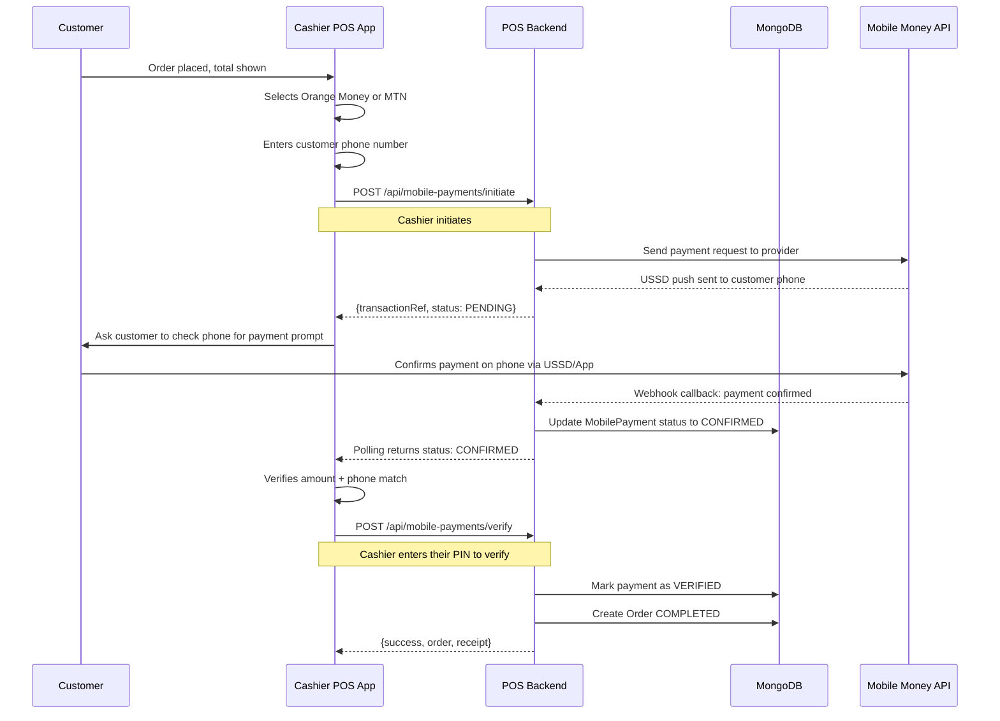
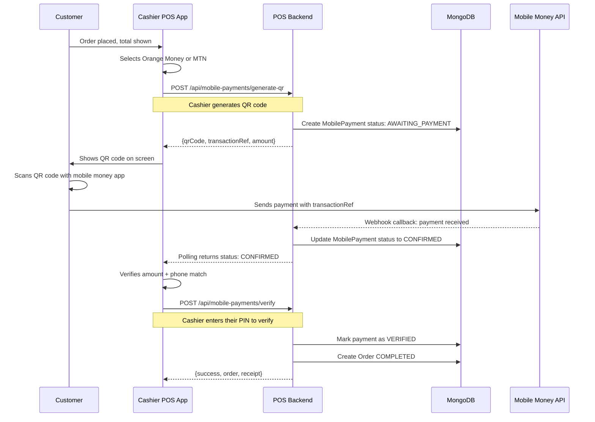
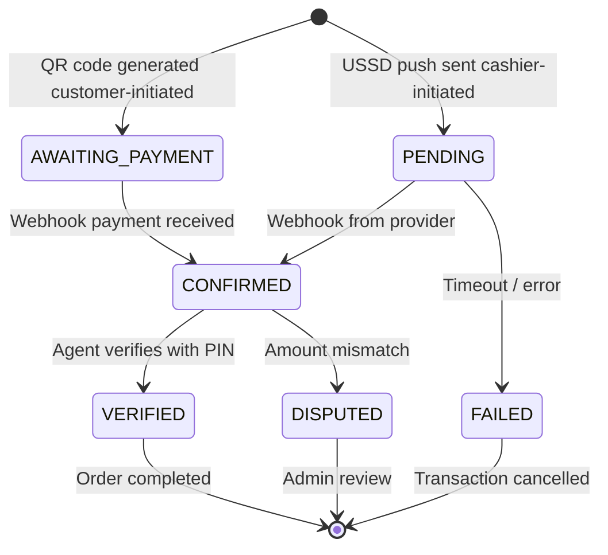
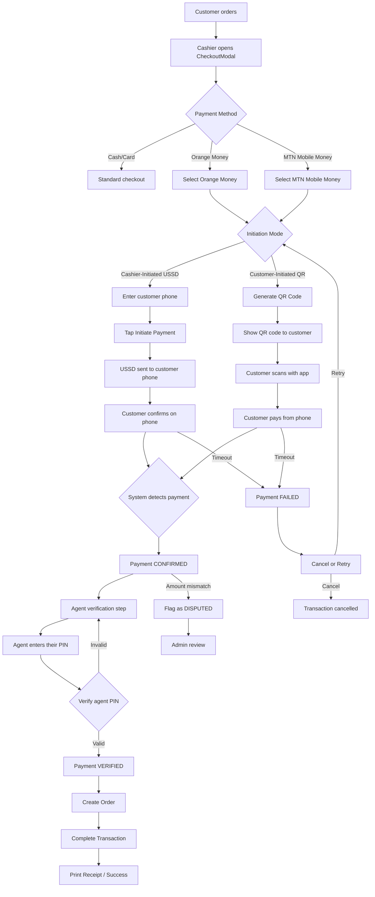

# Mobile Money Integration Plan: Orange Money & MTN Mobile Money

## 1. Overview

This plan integrates **Orange Money** and **MTN Mobile Money** as real payment methods into the POS system. The current system has a simulated mobile money flow (`MobileMoneyPayment.js` + `payments.js`) that needs to be replaced with a real, verifiable payment workflow.

### Key Requirements

- **Two initiation modes supported:**
  1. **Cashier-initiated** (USSD push) — cashier enters customer's phone, system sends USSD prompt to customer's phone
  2. **Customer-initiated** (QR code) — customer scans a QR code at the table/register and pays from their own phone
- **Customer receives the USSD prompt** on their phone and confirms the payment
- **Cashier verifies** the payment before completing the sale (agent PIN verification)
- **System tracks all sales** with full audit trail (transaction ID, provider, phone, amount, timestamp, agent who verified)
- **Two providers**: Orange Money (`orange`) and MTN Mobile Money (`mtn`)

---

## 2. Architecture

### 2.1 Initiation Mode A: Cashier-Initiated (USSD Push)

The cashier enters the customer's phone number at the POS terminal. The system sends a USSD payment prompt to the customer's phone. The customer confirms on their phone.



### 2.2 Initiation Mode B: Customer-Initiated (QR Code)

The system generates a QR code containing the order total and a unique payment reference. The customer scans the QR code with their Orange Money or MTN app and pays directly from their phone. The system detects the incoming payment and matches it to the order.



### 2.3 Payment State Machine



---

## 3. Data Model Changes

### 3.1 New Model: `MobilePayment`

Create a new Mongoose model at [`backend/models/MobilePayment.js`](backend/models/MobilePayment.js) to track each mobile money payment independently.

```javascript
const mobilePaymentSchema = new mongoose.Schema({
  // Provider info
  provider: {
    type: String,
    enum: ['orange', 'mtn'],
    required: true,
  },
  phone: {
    type: String,
    required: true,
  },
  amount: {
    type: Number,
    required: true,
  },
  currency: {
    type: String,
    default: 'XAF', // Central African CFA franc
  },

  // Transaction references
  transactionRef: {
    type: String,
    unique: true,
    required: true,
  },
  providerRef: {
    type: String,
    default: '', // Reference from the mobile money API
  },

  // Initiation mode
  initiationMode: {
    type: String,
    enum: ['cashier_initiated', 'customer_initiated'],
    default: 'cashier_initiated',
  },

  // Status tracking
  status: {
    type: String,
    enum: ['AWAITING_PAYMENT', 'PENDING', 'CONFIRMED', 'VERIFIED', 'FAILED', 'DISPUTED'],
    default: 'PENDING',
  },

  // Verification
  verifiedBy: {
    type: mongoose.Schema.Types.ObjectId,
    ref: 'Employee',
    default: null,
  },
  verifiedAt: {
    type: Date,
    default: null,
  },

  // Order link
  orderId: {
    type: mongoose.Schema.Types.ObjectId,
    ref: 'Order',
    default: null,
  },
  transactionId: {
    type: mongoose.Schema.Types.ObjectId,
    ref: 'Transaction',
    default: null,
  },

  // Audit
  initiatedBy: {
    type: mongoose.Schema.Types.ObjectId,
    ref: 'Employee',
  },
  initiatedAt: {
    type: Date,
    default: Date.now,
  },
  confirmedAt: {
    type: Date,
    default: null,
  },
  failedAt: {
    type: Date,
    default: null,
  },
  failureReason: {
    type: String,
    default: '',
  },

  // Metadata
  metadata: {
    type: Map,
    of: mongoose.Schema.Types.Mixed,
    default: {},
  },
}, { timestamps: true });

// Indexes
mobilePaymentSchema.index({ transactionRef: 1 });
mobilePaymentSchema.index({ status: 1, createdAt: -1 });
mobilePaymentSchema.index({ phone: 1, status: 1 });
mobilePaymentSchema.index({ provider: 1, status: 1 });
```

### 3.2 Order Model Updates

Add mobile payment verification fields to [`backend/models/Order.js`](backend/models/Order.js):

```javascript
// Replace existing mobile money fields with:
mobilePaymentRef: {
  type: mongoose.Schema.Types.ObjectId,
  ref: 'MobilePayment',
  default: null,
},
mobileMoneyProvider: { type: String, default: '' },
mobileMoneyPhone: { type: String, default: '' },
mobileMoneyTransactionRef: { type: String, default: '' },
mobileMoneyVerifiedBy: { type: String, default: '' },
mobileMoneyVerifiedAt: { type: Date, default: null },
```

---

## 4. Backend API Endpoints

### 4.1 New Route: [`backend/routes/mobile-payments.js`](backend/routes/mobile-payments.js)

| Method | Endpoint | Description |
|--------|----------|-------------|
| `POST` | `/api/mobile-payments/initiate` | Cashier-initiated: send USSD push to customer phone |
| `POST` | `/api/mobile-payments/generate-qr` | Customer-initiated: generate QR code for customer to scan |
| `POST` | `/api/mobile-payments/webhook/:provider` | Webhook callback from mobile money provider |
| `GET` | `/api/mobile-payments/status/:transactionRef` | Check payment status (polling) |
| `POST` | `/api/mobile-payments/verify` | Agent verifies a confirmed payment |
| `GET` | `/api/mobile-payments/history` | List all mobile payments (filterable) |
| `GET` | `/api/mobile-payments/pending-verification` | Get payments awaiting agent verification |

### 4.2 Endpoint Details

#### `POST /api/mobile-payments/initiate`

**Request:**
```json
{
  "provider": "orange" | "mtn",
  "phone": "670000000",
  "amount": 25.50,
  "transactionId": "txn_id_from_pos",
  "initiatedBy": "employee_id"
}
```

**Response:**
```json
{
  "success": true,
  "payment": {
    "transactionRef": "MP-1712345678-ABC123",
    "provider": "orange",
    "phone": "670000000",
    "amount": 25.50,
    "status": "PENDING",
    "message": "Payment request sent. Customer should check their phone."
  }
}
```

**Algorithm:**
1. Validate provider (`orange` or `mtn`)
2. Validate phone format (9-digit Cameroon format: `6XXXXXXXX`)
3. Generate unique `transactionRef` (`MP-{timestamp}-{random6}`)
4. Create `MobilePayment` document with `status: PENDING`
5. In production: call provider API to send USSD push
6. In dev/simulation: auto-confirm after 15s delay
7. Return the payment record

#### `POST /api/mobile-payments/generate-qr`

Generate a QR code for customer-initiated payment. The customer scans this QR code with their mobile money app to pay directly.

**Request:**
```json
{
  "provider": "orange" | "mtn",
  "amount": 25.50,
  "transactionId": "txn_id_from_pos",
  "initiatedBy": "employee_id"
}
```

**Response:**
```json
{
  "success": true,
  "payment": {
    "transactionRef": "MP-1712345678-ABC123",
    "provider": "orange",
    "amount": 25.50,
    "status": "AWAITING_PAYMENT",
    "initiationMode": "customer_initiated"
  },
  "qrCode": {
    "svg": "<svg>...</svg>",
    "payload": {
      "type": "mobile_payment",
      "transactionRef": "MP-1712345678-ABC123",
      "provider": "orange",
      "amount": 25.50,
      "merchant": "POS System"
    }
  }
}
```

**Algorithm:**
1. Validate provider (`orange` or `mtn`)
2. Generate unique `transactionRef` (`MP-{timestamp}-{random6}`)
3. Create `MobilePayment` document with `status: AWAITING_PAYMENT`, `initiationMode: customer_initiated`
4. Generate QR code payload containing `transactionRef`, `amount`, `provider`, `merchant`
5. Return QR code SVG + payment record
6. System waits for webhook callback with matching `transactionRef`

#### `POST /api/mobile-payments/webhook/:provider`

**Request (simulated):**
```json
{
  "transactionRef": "MP-1712345678-ABC123",
  "providerRef": "OR-987654321",
  "status": "SUCCESS",
  "amount": 25.50,
  "phone": "670000000"
}
```

**Algorithm:**
1. Look up `MobilePayment` by `transactionRef`
2. Verify amount matches (if not, mark `DISPUTED`)
3. Update status to `CONFIRMED`, set `confirmedAt`
4. If order exists, update order status
5. Return 200 OK

#### `POST /api/mobile-payments/verify`

**Request:**
```json
{
  "transactionRef": "MP-1712345678-ABC123",
  "verifiedBy": "employee_id",
  "agentPin": "1234"
}
```

**Algorithm:**
1. Look up `MobilePayment` by `transactionRef`
2. Verify status is `CONFIRMED` (cannot verify pending/failed)
3. Verify agent PIN via `Employee.comparePin()`
4. Update status to `VERIFIED`, set `verifiedBy` and `verifiedAt`
5. Return success with payment + order data

#### `GET /api/mobile-payments/pending-verification`

**Query params:** `?provider=orange&phone=670000000`

**Algorithm:**
1. Query `MobilePayment` where `status: CONFIRMED`
2. Optionally filter by `provider` and/or `phone`
3. Return list sorted by `confirmedAt` descending (newest first)
4. Limit to last 50 results

---

## 5. Frontend Changes

### 5.1 New Component: [`frontend/components/MobilePaymentFlow.js`](frontend/components/MobilePaymentFlow.js)

A multi-step wizard component that replaces the current `MobileMoneyPayment.js`. Supports **two initiation modes**:

#### Mode A: Cashier-Initiated (USSD Push)
The cashier drives every step — the customer only receives the USSD prompt on their phone.

```
Step 1: Cashier selects provider (Orange Money / MTN)
Step 2: Cashier enters customer's phone number
Step 3: Cashier taps "Initiate Payment" → system sends USSD to customer
Step 4: Cashier tells customer "Check your phone to confirm payment"
Step 5: System polls for confirmation (auto-detects when customer pays)
Step 6: Cashier sees "Payment Confirmed" and verifies amount matches
Step 7: Cashier enters their PIN to verify the payment
Step 8: Success → Order completed, receipt printed
```

#### Mode B: Customer-Initiated (QR Code)
The cashier generates a QR code. The customer scans it with their mobile money app and pays from their own phone.

```
Step 1: Cashier selects provider (Orange Money / MTN)
Step 2: Cashier taps "Generate QR Code"
Step 3: QR code displayed on screen with amount and provider
Step 4: Customer scans QR code with their mobile money app
Step 5: Customer confirms payment on their phone
Step 6: System detects payment via webhook
Step 7: Cashier sees "Payment Received" and verifies amount matches
Step 8: Cashier enters their PIN to verify the payment
Step 9: Success → Order completed, receipt printed
```

### 5.2 Updates to [`frontend/components/CheckoutModal.js`](frontend/components/CheckoutModal.js)

- Replace `PAYMENT_METHODS` entry for `mobile_money` with two separate entries:
  - `orange_money` → Orange Money
  - `mtn_money` → MTN Mobile Money
- Integrate `MobilePaymentFlow` component into the checkout flow
- Add verification step before order completion
- Show pending-verification badge if there are unverified payments

### 5.3 Agent Verification Panel

Add a **"Pending Verifications"** section to the POS dashboard or checkout screen that shows:
- Payments that are `CONFIRMED` but not yet `VERIFIED`
- Agent can tap to view details and verify with their PIN

---

## 6. Algorithms & Business Logic

### 6.1 Payment Initiation Algorithm

```
FUNCTION initiatePayment(provider, phone, amount, initiatedBy):
  VALIDATE provider IN ['orange', 'mtn']
  VALIDATE phone matches /^6[0-9]{8}$/
  VALIDATE amount > 0

  SET transactionRef = generateRef('MP')

  CREATE MobilePayment {
    provider, phone, amount,
    transactionRef,
    status: 'PENDING',
    initiatedBy, initiatedAt: now()
  }

  IF environment == 'production':
    CALL provider API to send payment request
    // Provider sends USSD push to customer phone
  ELSE:
    SCHEDULE auto-confirm after 15 seconds

  RETURN { transactionRef, status: 'PENDING' }
```

### 6.2 QR Code Generation Algorithm (Customer-Initiated)

```
FUNCTION generatePaymentQR(provider, amount, initiatedBy):
  VALIDATE provider IN ['orange', 'mtn']
  VALIDATE amount > 0

  SET transactionRef = generateRef('MP')

  CREATE MobilePayment {
    provider,
    amount,
    transactionRef,
    status: 'AWAITING_PAYMENT',
    initiationMode: 'customer_initiated',
    initiatedBy,
    initiatedAt: now()
  }

  SET qrPayload = {
    type: 'mobile_payment',
    transactionRef: transactionRef,
    provider: provider,
    amount: amount,
    merchant: 'POS System',
    timestamp: now()
  }

  GENERATE QR code SVG from qrPayload

  RETURN { transactionRef, qrCode: { svg, payload: qrPayload }, status: 'AWAITING_PAYMENT' }
```

### 6.2 Payment Verification Algorithm (Agent)

```
FUNCTION verifyPayment(transactionRef, agentId, agentPin):
  payment = FIND MobilePayment WHERE transactionRef

  IF payment.status != 'CONFIRMED':
    THROW "Payment must be CONFIRMED before verification"

  agent = FIND Employee WHERE _id = agentId
  IF NOT agent.comparePin(agentPin):
    THROW "Invalid agent PIN"

  UPDATE payment {
    status: 'VERIFIED',
    verifiedBy: agentId,
    verifiedAt: now()
  }

  // Auto-complete the associated order if exists
  IF payment.orderId:
    UPDATE Order WHERE _id = payment.orderId {
      status: 'completed',
      mobileMoneyVerifiedBy: agent.name,
      mobileMoneyVerifiedAt: now()
    }

  RETURN payment
```

### 6.3 Amount Mismatch Detection (Webhook)

```
FUNCTION handleWebhook(transactionRef, providerRef, status, amount, phone):
  payment = FIND MobilePayment WHERE transactionRef

  IF ABS(payment.amount - amount) > 0.01:
    UPDATE payment {
      status: 'DISPUTED',
      metadata: {
        expectedAmount: payment.amount,
        receivedAmount: amount,
        disputeReason: 'AMOUNT_MISMATCH'
      }
    }
    ALERT admin about dispute
    RETURN

  UPDATE payment {
    status: 'CONFIRMED',
    providerRef,
    confirmedAt: now()
  }
```

### 6.4 Polling / Real-Time Status Updates

The frontend polls `GET /api/mobile-payments/status/:transactionRef` every 5 seconds while in the "waiting for confirmation" step. Alternatively, use **Server-Sent Events (SSE)** or **WebSocket** for real-time updates.

---

## 7. Environment Configuration

Add to [`backend/.env.example`](backend/.env.example):

```env
# Mobile Money Configuration
MOBILE_MONEY_MODE=simulation    # simulation | production

# Orange Money API (production)
ORANGE_MONEY_API_URL=https://api.orange.com/money/v1
ORANGE_MONEY_CLIENT_ID=your_client_id
ORANGE_MONEY_CLIENT_SECRET=your_client_secret

# MTN Mobile Money API (production)
MTN_MOMO_API_URL=https://sandbox.momodeveloper.mtn.com/v1_0
MTN_MOMO_SUBSCRIPTION_KEY=your_subscription_key
MTN_MOMO_API_USER=your_api_user
MTN_MOMO_API_KEY=your_api_key
```

---

## 8. Implementation Steps

### Step 1: Create MobilePayment Model
- File: [`backend/models/MobilePayment.js`](backend/models/MobilePayment.js)
- Schema with all fields listed in Section 3.1
- Indexes for fast queries

### Step 2: Update Order Model
- File: [`backend/models/Order.js`](backend/models/Order.js)
- Add `mobilePaymentRef` and verification fields

### Step 3: Create Mobile Payments Route
- File: [`backend/routes/mobile-payments.js`](backend/routes/mobile-payments.js)
- Implement all 6 endpoints from Section 4
- Simulation mode with auto-confirm delay
- Webhook handler with amount mismatch detection

### Step 4: Register Route in Server
- File: [`backend/server.js`](backend/server.js)
- Add `app.use('/api/mobile-payments', mobilePaymentRoutes)`

### Step 5: Create MobilePaymentFlow Component
- File: [`frontend/components/MobilePaymentFlow.js`](frontend/components/MobilePaymentFlow.js)
- Multi-step wizard: Select Provider → Phone → Initiate → Wait → Verify → Success
- Polling for status updates
- Agent PIN verification step

### Step 6: Update CheckoutModal
- File: [`frontend/components/CheckoutModal.js`](frontend/components/CheckoutModal.js)
- Split `mobile_money` into `orange_money` and `mtn_money`
- Integrate MobilePaymentFlow
- Add verification step before order completion

### Step 7: Add Pending Verifications UI
- File: [`frontend/components/PendingVerifications.js`](frontend/components/PendingVerifications.js)
- List of CONFIRMED payments awaiting agent verification
- Quick-verify with agent PIN

### Step 8: Update Seed Script
- File: [`backend/seed.js`](backend/seed.js)
- Add sample mobile payment records for testing

### Step 9: Testing
- Test initiation flow for both providers
- Test webhook confirmation
- Test agent verification
- Test amount mismatch dispute
- Test polling/status updates
- Test full checkout flow end-to-end

---

## 9. Mermaid Diagram: Full Checkout Flow with Mobile Money



---

## 10. Security Considerations

1. **Agent PIN verification**: Every payment must be verified by an agent's PIN before the order is completed. This prevents fraudulent payments.
2. **Amount mismatch detection**: The webhook handler compares the expected amount vs. the actual amount received from the provider. Discrepancies are flagged as `DISPUTED`.
3. **Idempotency**: Each `transactionRef` is unique. Duplicate webhook calls are safely handled by checking existing status.
4. **Audit trail**: Every state change is timestamped. The `verifiedBy` field links to the employee who approved the payment.
5. **Simulation mode**: During development, `MOBILE_MONEY_MODE=simulation` auto-confirms payments after 15 seconds. In production, real API calls are made.

---

## 11. Files to Create / Modify

| Action | File | Description |
|--------|------|-------------|
| CREATE | [`backend/models/MobilePayment.js`](backend/models/MobilePayment.js) | New payment tracking model |
| MODIFY | [`backend/models/Order.js`](backend/models/Order.js) | Add mobile payment verification fields |
| CREATE | [`backend/routes/mobile-payments.js`](backend/routes/mobile-payments.js) | All mobile payment API endpoints |
| MODIFY | [`backend/server.js`](backend/server.js) | Register new route |
| MODIFY | [`backend/.env.example`](backend/.env.example) | Add mobile money config vars |
| CREATE | [`frontend/components/MobilePaymentFlow.js`](frontend/components/MobilePaymentFlow.js) | Multi-step payment wizard |
| MODIFY | [`frontend/components/CheckoutModal.js`](frontend/components/CheckoutModal.js) | Integrate new payment flow |
| CREATE | [`frontend/components/PendingVerifications.js`](frontend/components/PendingVerifications.js) | Agent verification panel |
| MODIFY | [`backend/seed.js`](backend/seed.js) | Add test payment records |
