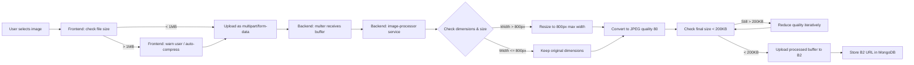

# Smart Image Processor — POS Menu Image Optimization

## 1. Problem

Currently, users upload raw images (potentially 10MB+ phone photos) that get stored directly in Backblaze B2. For a POS system, these images are displayed in small card thumbnails (120px height on menu cards, 48px in inventory). Storing and serving full-resolution images is wasteful:

- **Slow uploads** — large files take longer over mobile/limited connections
- **Wasted B2 storage** — a 4000x3000 photo (~5MB) is overkill for a 120px-tall card
- **Slow frontend loading** — downloading multi-MB images for tiny thumbnails
- **Bandwidth costs** — B2 charges for egress

## 2. Solution: Smart Image Processing Pipeline



## 3. Target Specifications

| Context | Display Size | Target Upload Size | Max Dimensions |
|---------|-------------|-------------------|----------------|
| Menu card image | 120px height, full width card | ≤ 200KB | 800px width, 600px height |
| Inventory thumbnail | 48px height | ≤ 50KB | 200px width |
| Avatar/thumbnail | 48px height | ≤ 50KB | 200px width |

## 4. Files to Create/Modify

### New File
| File | Purpose |
|------|---------|
| [`backend/services/image-processor.js`](backend/services/image-processor.js) | Image processing service — resize, compress, format conversion |

### Modified Files
| File | Change |
|------|--------|
| [`backend/routes/upload.js`](backend/routes/upload.js) | Integrate image processor into upload pipeline |
| [`backend/package.json`](backend/package.json) | Add `sharp` dependency (fast image processing) |
| [`frontend/components/InventoryPanel.js`](frontend/components/InventoryPanel.js) | Add client-side file size check before upload |

## 5. Image Processor Service Design

### [`backend/services/image-processor.js`](backend/services/image-processor.js)

```javascript
class ImageProcessor {
  // Configuration
  static MENU_IMAGE_MAX_WIDTH = 800;
  static MENU_IMAGE_MAX_HEIGHT = 600;
  static MENU_IMAGE_TARGET_SIZE = 200 * 1024; // 200KB
  static MENU_IMAGE_QUALITY_START = 85;
  static MENU_IMAGE_QUALITY_MIN = 40;
  
  static THUMBNAIL_MAX_WIDTH = 200;
  static THUMBNAIL_TARGET_SIZE = 50 * 1024; // 50KB
  
  static AVATAR_SIZE = 200; // square
  
  /**
   * Process a menu item image:
   * 1. Resize to max 800px width (maintain aspect ratio)
   * 2. Convert to JPEG
   * 3. Compress to ~200KB with iterative quality reduction
   * 
   * @param {Buffer} inputBuffer - Raw image buffer from multer
   * @param {string} mimeType - Original MIME type
   * @returns {Promise<{buffer: Buffer, mimeType: string, width: number, height: number, size: number}>}
   */
  async processMenuImage(inputBuffer, mimeType) { ... }
  
  /**
   * Process a thumbnail (inventory list):
   * 1. Resize to max 200px width
   * 2. Compress to ~50KB
   */
  async processThumbnail(inputBuffer, mimeType) { ... }
  
  /**
   * Process an avatar (square crop):
   * 1. Center-crop to square
   * 2. Resize to 200x200
   * 3. Compress to ~50KB
   */
  async processAvatar(inputBuffer, mimeType) { ... }
  
  /**
   * Check if image needs processing based on size/dimensions.
   * Skip processing for already-small images to avoid quality loss.
   */
  needsProcessing(inputBuffer, mimeType) { ... }
}
```

### Algorithm Details

**Step 1 — Size Check (before processing)**
```javascript
needsProcessing(buffer) {
  // Skip processing if already under 100KB and reasonable dimensions
  return buffer.length > 100 * 1024; // > 100KB needs processing
}
```

**Step 2 — Resize (maintain aspect ratio)**
```javascript
// Use sharp to resize
const metadata = await sharp(buffer).metadata();
let resizeOptions = { width: 800, withoutEnlargement: true };
if (metadata.width > 800) {
  buffer = await sharp(buffer).resize(resizeOptions).jpeg({ quality: 85 }).toBuffer();
}
```

**Step 3 — Iterative Compression**
```javascript
// Start at quality 85, reduce until under target size or min quality reached
let quality = 85;
let processed;
while (quality >= 40) {
  processed = await sharp(buffer).jpeg({ quality }).toBuffer();
  if (processed.length <= 200 * 1024) break;
  quality -= 5;
}
```

**Step 4 — Format Conversion**
- Always convert to JPEG for menu images (smaller file size, universal support)
- Preserve PNG for graphics with transparency (detected via metadata)

## 6. Integration into Upload Route

### Modified [`backend/routes/upload.js`](backend/routes/upload.js)

```javascript
const imageProcessor = require('../services/image-processor');

// Inside POST /api/upload/menu/:id/image handler:
// After multer parses the file, before B2 upload:

// 1. Check if processing is needed
if (imageProcessor.needsProcessing(req.file.buffer)) {
  // 2. Process the image (resize + compress)
  const processed = await imageProcessor.processMenuImage(
    req.file.buffer, 
    req.file.mimetype
  );
  req.file.buffer = processed.buffer;
  req.file.mimetype = processed.mimeType;
  req.file.size = processed.size;
}

// 3. Then upload processed buffer to B2 (existing code)
```

## 7. Frontend Changes

### [`frontend/components/InventoryPanel.js`](frontend/components/InventoryPanel.js)

Add client-side file size validation before upload:

```javascript
const handleImageUpload = async (itemId, file) => {
  if (!file) return;
  
  // Client-side size check
  const MAX_SIZE = 10 * 1024 * 1024; // 10MB raw limit
  if (file.size > MAX_SIZE) {
    Alert.alert('File Too Large', `Image is ${(file.size / 1024 / 1024).toFixed(1)}MB. Maximum is 10MB.`);
    return;
  }
  
  // Show size info to user
  const sizeKB = (file.size / 1024).toFixed(0);
  console.log(`Uploading ${file.name} (${sizeKB}KB)`);
  
  setUploadingImage(itemId);
  try {
    const formData = new FormData();
    formData.append('file', file);
    // ... rest of upload
  }
};
```

## 8. Dependency

Add to [`backend/package.json`](backend/package.json):
```json
"sharp": "^0.33.0"
```

**Why `sharp` instead of `canvas`?**
- `sharp` is 4-5x faster for resize/compress operations
- Lower memory usage
- Native libvips binding — handles JPEG/PNG/WebP efficiently
- `canvas` is already installed but is better for rendering/drawing, not batch processing

## 9. Implementation Steps

### Step 1: Install sharp
```bash
cd backend && npm install sharp
```

### Step 2: Create image processor service
- [`backend/services/image-processor.js`](backend/services/image-processor.js) — resize, compress, format conversion

### Step 3: Update upload route
- [`backend/routes/upload.js`](backend/routes/upload.js) — integrate processor into POST /api/upload/menu/:id/image

### Step 4: Update frontend
- [`frontend/components/InventoryPanel.js`](frontend/components/InventoryPanel.js) — add client-side file size check

### Step 5: Test
- Upload a large image (e.g., 5MB phone photo) → verify it's resized to ≤200KB
- Upload a small image (e.g., 50KB icon) → verify it's NOT processed (skip to avoid quality loss)
- Verify B2 stores the optimized version
- Verify frontend loads the optimized image

## 10. Edge Cases

| Scenario | Handling |
|----------|----------|
| Image already < 100KB | Skip processing entirely — no quality loss |
| Image is PNG with transparency | Convert to JPEG only if > 200KB after resize; keep PNG if small |
| Image is very small (e.g., 100x100) | `withoutEnlargement: true` — never upscale |
| GIF animation | Keep as GIF, only resize dimensions |
| Corrupt image file | `sharp` throws error → caught by try/catch → 400 response |
| User uploads 50MB photo | Multer `limits.fileSize` rejects at 5MB (already configured) |
